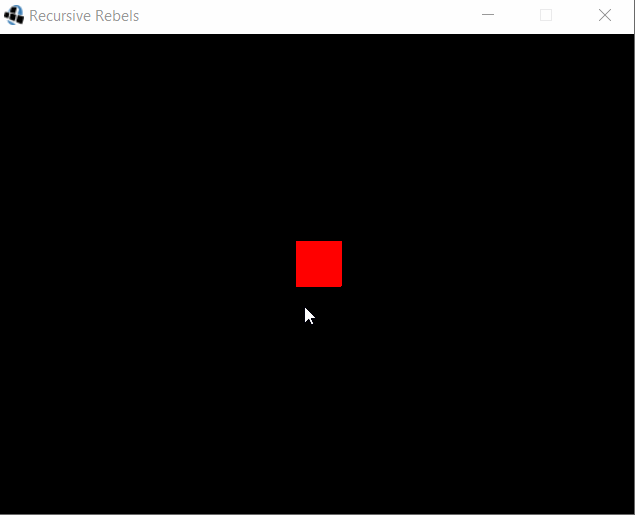
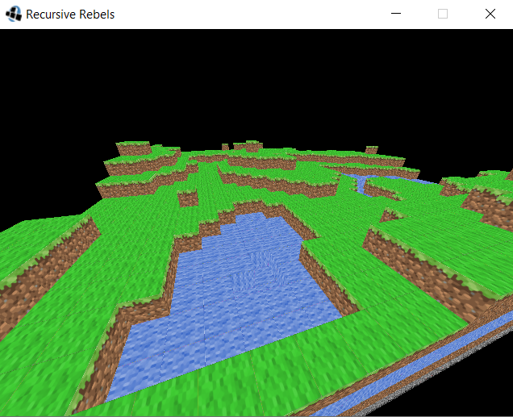

# Recursive-Rebels-3D-World

Contributors: Nhat Tran, Stephanie Pocci, Sean Leung

## Overview

Create an original scene in Minecraft fashion. It is simple but can be used to demonstrate different aspects of graphics like texture mapping, lighting, visible surface detection, surface rendering etc. We will be unable to cover some of the more advanced concepts in this course but learning to implement them using OpenGL through our LWJG Library is very simple. Hence, this project forces you to explore features of the LWJGL.

## Product Spec

### User Stories (Required and Optional)

**Required Must-have Stories**

Check Point 1:

- [x] The Java style sheet should be followed with code separated into separate classes as needed.
- [x] Have a window created that is 640x480 and centered on the screen.
- [x] Be able to display a cube (which is at least 2 in width) in 3D space with each face colored differently.
- [x] Be able to manipulate the camera with the mouse to give a first person appearance
- [x] Be able to navigate the environment using the input.Keyboard class with either the w,a,s,d keys or the arrow keys to move around as well as the space bar to move up and the left shift button to go down.
- [x] Use the escape key quit your application.

Check Point 2:

- [x] Be able to draw multiple cubes using our chunks method (creating a world at least 30 cubes x 30 cubes large), with each cube textured and then randomly placed using the simplex noise classes provided (Your terrain should be randomly placed each time you run the program but still appear to smoothly rise and fall as opposed to sudden mountains and valleys appearing).
- [x] Have a minimum of 6 cube types defined with a different texture for each one as follows: Grass, sand, water, dirt, stone, and bedrock.

Check Point 3:

- [ ] Be able to correctly place only grass, sand, or water at the topmost level of terrain, dirt, or stone at levels below the top, and bedrock at the very bottom of the generated terrain.
- [ ] A light source should be created that will leave half the world brightly lit and the other half dimly illuminated.

Final Check Point:

- [ ] Decide on three extra functionalities (such as making sure the user does not go past the
      edge of your created “universe”, collision detection, gravity, “face picking”, day/night cycles, adding
      flora randomly, river or lake generation, etc… this is not a complete list but rather some ideas to get you
      to start thinking of what some extra functionalities you may want to add) to the core program
      requirements we will be looking for. These added functions should be clearly stated in detail in your
      comments, including how they work (Press F1 to change everything from the current texture to one that
      makes it look like an alien world for example).

### App Evaluation

### Final Product
